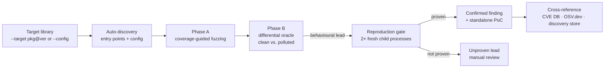

<h1 align="center">UoPFuzz</h1>

<p align="center">
  <b>Find prototype-pollution gadgets in JavaScript libraries — and only report the ones that actually reproduce.</b>
</p>

<p align="center">
  <a href="https://github.com/acuciureanu/uopfuzz/actions/workflows/ci.yml"></a>
  <a href="LICENSE"></a>
  
  
</p>

<p align="center">
  
</p>

UoPFuzz points coverage-guided fuzzing at a JavaScript library, pollutes
`Object.prototype`, and watches whether the library reads an attacker-controlled
property that reaches a dangerous sink. The name comes from the
**undefined-oriented programming (UOP)** view: a library reads a property that
*doesn't exist on the object*, so it resolves up the prototype chain to whatever
an attacker planted there.

It covers both server-side and client-side gadgets:

- **Server-side** — code execution (`eval`, `Function`, `child_process.exec`),
  template-compilation injection (e.g. EJS `outputFunctionName`), SSRF
  (`http.request`), and LFI (`fs.readFile`).
- **Client-side** — browser libraries load under jsdom, and DOM-XSS /
  script-injection sinks are hooked (`innerHTML`, `outerHTML`,
  `insertAdjacentHTML`, `document.write`, dangerous `setAttribute`, and
  `script`/`iframe`/`img` `src`) — the gadget classes catalogued in
  [BlackFan/client-side-prototype-pollution](https://github.com/BlackFan/client-side-prototype-pollution).
  jsdom does not execute scripts, so client-side findings prove **reachability**
  of a polluted value to a sink, not execution.

What makes it different from a heuristic scanner: **a finding is only reported
after it is independently reproduced in fresh, isolated child processes.** No
reproduction, no vulnerability — just a clearly-labelled lead for manual review.
Confirmed gadgets carry their true impact (RCE / SSRF / LFI / XSS) from the sink
they were proven to reach, and ship with a runnable PoC — including
**self-contained exploits** where a single library is both the pollution source
and the gadget (see [How this differs](#how-this-differs)).

> ⚠️ **This is a research tool that executes untrusted code and generates real,
> working exploits.** Read [Safety model](#safety-model) before pointing it at a
> package you don't control.

---

## Contents

- [Why UoPFuzz](#why-uopfuzz)
- [How it works](#how-it-works)
- [How this differs](#how-this-differs)
- [Runtime gadgets & the GHunter A/B](#runtime-gadgets--the-ghunter-ab)
- [Install](#install)
- [Quick start](#quick-start)
- [Use cases](#use-cases)
- [Understanding the output](#understanding-the-output)
- [Reproduction-gated reporting](#reproduction-gated-reporting)
- [Safety model](#safety-model)
- [Documentation](#documentation)
- [Contributing & security](#contributing--security)
- [License](#license)

## Why UoPFuzz

Prototype pollution is easy to *find* and hard to *prove*. A property read on a
polluted prototype might be exploitable, or it might be a dead end. Most tooling
stops at "this property was read" — which drowns you in false positives.

UoPFuzz is built around a single discipline: **causation over correlation, and
reproduction over heuristics.**

- **Differential oracle** — runs the target twice (clean vs. polluted) and only
  cares about behaviour the pollution *caused*.
- **Reproduction gate** — every candidate is re-proven in two fresh Node
  processes by a second, independent oracle that checks ground-truth facts (a
  real own-property added to a builtin prototype, or a canary that actually
  executes). On the project's [ground-truth benchmark](benchmark/RESULTS.md)
  this yields a **0% false-positive rate** against patched versions.
- **Runnable proof** — every confirmed finding ships a standalone PoC you can run
  with `node`.

It targets Node.js libraries (and browser-only libraries via jsdom), with a bias
toward real, published, high-impact bugs.

## How it works



| Stage | What it does |
|-------|--------------|
| **Target Integration** | Installs / loads the library and auto-generates entry points |
| **Input Generation** | Coverage-guided fuzzing with UOP-specific mutations (Thompson-sampled strategies) |
| **Instrumentation** | AFL-style edge coverage + V8 precise coverage + Proxy taint tracking |
| **Gadget Analysis** | Turns pollution → sink traces into ranked candidates |
| **Verification** | Reproduces each candidate in fresh child processes — the only thing that confirms a finding |

See [`docs/architecture.md`](docs/architecture.md) for the full pipeline.

## How this differs

Server-side prototype-pollution gadget hunting is well-studied — the reference
points are **Silent Spring** (USENIX '23), **Dasty**, and **GHunter** (USENIX
'24) from KTH-LangSec, and the recent **Bullseye** (NDSS '26). UoPFuzz is *not* a
new detection algorithm; it is an operationalized, reproduction-gated take on
dynamic gadget hunting. Two things set it apart.

**1. Behavioural auto-discovery + a reproduction gate — not a test suite, not a
heuristic.** Dasty and GHunter are driven by a target's own test suite, so
they're blind to any code path the tests don't exercise. UoPFuzz auto-discovers
entry points by *probing* them (`--target pkg` needs no config), so untested
paths stay in scope. Every finding is then re-proven in two fresh processes
against a ground-truth oracle (a real own-property added to a prototype, or a
canary that actually executes) before it's reported; candidates that don't
reproduce are labelled leads, not vulnerabilities. **That's the real edge: which
absent property a library reads and which sink it reaches — verified, not
guessed.**

**2. It can assemble a runnable exploit, and flags the self-contained ones.** A
gadget only matters if a prototype-pollution *source* can reach it. Because
pollution is a *global* effect, any function that merges attacker input into an
object is an interchangeable source — so once UoPFuzz confirms a gadget it pairs
it with a real, currently-shipping source and reproduces a runnable
`attacker-input → source → gadget → sink` PoC. This one was assembled
automatically across two real, installable packages (each with its own CVE):

```javascript
// PoC — prototype-pollution RCE in ejs@3.1.6 via render(), reproduced in 2 fresh
// processes. The SOURCE pollutes Object.prototype; the gadget then reaches its
// code-execution sink. No pollution is assumed — the source does it.
//
// Source: assign-deep@1.0.0 (CVE-2019-10747)  — interchangeable; any PP source works
const source = require('assign-deep');
const target = require('ejs');
source({}, JSON.parse('{"__proto__": ' + JSON.stringify({ "outputFunctionName": "<attacker code>" }) + '}'));
target.render(/* attacker-influenced input */);
// The polluted property reaches a code-execution sink and runs attacker code.
```

The cross-library PoC is *actionability, not a second discovery* — the source is
swappable; the **gadget is the finding**. The genuinely stronger case is when a
single library is *both* the source and the gadget: a **self-contained exploit**
that needs no external assumption, which UoPFuzz flags as such. Every finding also
carries its true impact from the sink it was proven to reach — RCE only for
genuine code/command execution, otherwise SSRF / LFI / XSS. Chaining is on by
default; `--no-chain` disables it.

| | Silent Spring | Dasty | GHunter | UoPFuzz |
|---|---|---|---|---|
| Approach | static taint | dynamic taint | dynamic (runtime) | differential + coverage-guided fuzzing |
| Driven by | source analysis | package test suite | runtime test suite | behavioural auto-discovery |
| Output | candidates | candidates | candidates | reproduced findings |
| Impact from proven sink (RCE/SSRF/LFI/XSS) | partial | — | — | **✓** |
| Runnable exploit PoC (self-contained flagged) | — | — | — | **✓** |
| Novelty triage (CVE · OSV · GHSA) | — | — | — | **✓ built-in** |
| Maintained runnable CLI | artifact | artifact | artifact | **✓** |

**Honest limits.** This is a *different posture, not a bigger one*. The discovery
sweep is deliberately relevance-filtered to a few dozen freshly-published
packages a day (see [`scripts/discovery`](scripts/discovery)), not a
whole-registry corpus scan like Dasty/Bullseye. And the reproduction gate trades
recall for its zero-false-positive property: a gadget that only fires under
conditions the harness can't recreate is reported as an unproven lead, not a
finding.

> **On the name.** *Undefined-oriented programming (UOP)* is our framing for the
> read-an-absent-property mechanic — not an established field. Note that the
> literature already uses *UOPF (Undefined-oriented Programming Framework)* for
> chaining PP gadgets in template engines; that is prior, separate work.

## Runtime gadgets & the GHunter A/B

Beyond npm packages, UoPFuzz hunts gadgets in the **Node.js runtime itself** —
the `NODE_OPTIONS`, `shell`, and TLS-verification properties that turn any
prototype pollution into code execution. Two commands drive this:

```bash
npm run benchmark:runtime-gadgets   # curated corpus of published runtime gadgets
npm run mine:runtime-gadgets        # mine the installed runtime for NEW gadgets
npm run ab:ghunter                  # replay GHunter's published table, compare
```

The miner harvests candidate properties from the runtime's own source, then
verifies each one differentially in clean-vs-polluted child processes — a
finding requires an observed behavior change or crash, never sink-reach alone.
Effects that only materialize in a live handshake (e.g. disabling TLS
certificate verification) are proven by a behavioral oracle against a loopback
server with a runtime-generated throwaway certificate.

Replayed against GHunter's published, manually-validated gadget table on
Node 24: **97% recall on the 33 gadgets still live** (17 of GHunter's 50 are
fixed or mitigated upstream and UoPFuzz says so, with evidence), plus **145
machine-verified gadgets GHunter never published** — at zero manual hours vs
their reported 31. Full tables:
[`benchmark/runtime-gadgets/RESULTS.md`](benchmark/runtime-gadgets/RESULTS.md)
and [`results/runtime-miner/AB-RESULTS.md`](results/runtime-miner/AB-RESULTS.md)
(regenerated by `npm run ab:ghunter`).

## Install

Requires **Node.js ≥ 20**.

```bash
git clone https://github.com/acuciureanu/uopfuzz.git
cd uopfuzz
npm install
```

## Quick start

```bash
# Point it at an npm package@version — installs it, finds and verifies gadgets
node src/cli.js --target lodash@4.17.4

# Or use a curated YAML target spec
node src/cli.js --config config/targets/ejs.yaml --output results/
```

Confirmed findings and their PoCs are written under `results/`. Full flag
reference is in [`docs/usage.md`](docs/usage.md).

> The demo target `lodash@4.17.4` is deliberately ancient: its prototype
> pollution is long-patched and publicly disclosed (e.g. CVE-2019-10744,
> CVE-2020-8203). It demonstrates the workflow on a known-good finding —
> it is not a new vulnerability in lodash.

> `--target` installs a package from npm and **executes its code**. On a
> non-sandboxed host the command refuses unless you pass
> `--i-understand-untrusted-code`; the intended way to run untrusted targets is
> the container (see [Safety model](#safety-model)).

## Use cases

<details open>
<summary><b>1. Audit a dependency before you ship it</b></summary>

Point UoPFuzz at the exact version in your lockfile. If it confirms a gadget,
you get a runnable PoC and a CVE/OSV cross-reference telling you whether it's
already public. If nothing reproduces, the run exits clean — no noise.

```bash
node src/cli.js --target deep-extend@0.5.0
```
</details>

<details>
<summary><b>2. Verify a patch actually fixes the bug (version regression scan)</b></summary>

Scan a library across versions to see exactly where a vulnerability was
introduced or fixed — great for validating a security advisory or your own
patch.

```bash
node src/cli.js versions --library lodash.js --range 4.17.4..4.17.21
```
</details>

<details>
<summary><b>3. Reproduce a known CVE and get a PoC</b></summary>

The curated configs under `config/targets/` model published CVEs (e.g. EJS
CVE-2022-29078). UoPFuzz reproduces them end-to-end and drops a standalone PoC.

```bash
node src/cli.js --config config/targets/ejs.yaml
```
</details>

<details>
<summary><b>4. Hunt gadgets across many libraries at scale (mass mode)</b></summary>

Sweep the most-used libraries from cdnjs and surface anything that reproduces.
Run this **inside the container** — it installs and executes a lot of untrusted code.

```bash
./run-sandboxed.sh mass --top 50
```
</details>

<details>
<summary><b>5. Benchmark & research</b></summary>

A ground-truth benchmark pairs known-vulnerable and patched versions and
measures true-/false-positive rates end-to-end.

```bash
npm run benchmark          # full pipeline against real packages
npm run benchmark:self-test  # scoring logic only, installs nothing
```

See [`benchmark/RESULTS.md`](benchmark/RESULTS.md) for the latest run.
</details>

## Understanding the output

A run produces two kinds of result:

- **Confirmed findings** (`confirmedChains`) — reproduced in fresh processes.
  These are the real ones, and each ships a standalone PoC under `results/`.
- **Unproven leads** (`candidateChains`) — a behavioural signal that did *not*
  reproduce. Kept for manual review, never counted as a vulnerability.

Every confirmed finding is labelled against the built-in CVE database, live
OSV.dev advisories, and the tool's own discovery store:

| Label | Meaning |
|-------|---------|
| **KNOWN CVE** | Matches a published advisory (built-in DB or OSV.dev) |
| **PREVIOUSLY DISCOVERED** | This tool reproduced the same bug on an earlier run |
| **UNDOCUMENTED VULNERABILITY** | Not in the advisory DB or OSV.dev — **a candidate that still needs human verification and responsible disclosure**, not a confirmed 0-day |

The proof itself is one of: **prototype pollution** (a real own-property added to
a builtin prototype), **code execution** (a canary token actually ran), or
**sink reachability** (a polluted value reached a code/command sink argument —
flow proven, execution not).

## Reproduction-gated reporting

A finding becomes a reported **vulnerability** only when a second oracle —
sharing no verdict logic with discovery — reproduces its ground-truth condition
in **two independent fresh Node processes**. Behavioural heuristics (output
changed, a property merely read) never confirm on their own.

On the [ground-truth benchmark](benchmark/RESULTS.md) this is a **0%
false-positive rate** against patched versions. That's a strong empirical
result, not an absolute guarantee. The tool **files nothing externally** — every
disclosure decision is yours. See `src/verification/reproduce.js` and
`tests/integration/zero-fp-validation.test.js`.

## Safety model

**Target code is executed, not simulated.** Finding gadgets means *running* the
library with attacker-shaped inputs, and reproduction deliberately lets a canary
execute to prove code execution. Treat every target as untrusted code that will
run on your machine.

> **The real isolation boundary is the container** (`run-sandboxed.sh`, backed by
> `.devcontainer/`) — dropped capabilities, seccomp, `no-new-privileges`,
> non-root user, memory/PID caps, no host secrets. **Run untrusted targets there.**

<details>
<summary>What the in-process hardening does and does not cover</summary>

- Inside the container, every discovery mode that calls target code — plus
  reproduction — runs in **forked child processes** with best-effort in-process
  hardening (`src/utils/worker-hardening.js`): outbound network (opt-in via
  `--allow-network`), `child_process`, and `worker_threads` are patched off, and
  secret-bearing env vars are stripped. These are speed bumps, **not a sandbox**
  against a targeted exploit — the child shares the process uid, filesystem, and
  network namespace.
- Browser-only libraries load under jsdom *inside* that child.
- Honest caveats: the target module is `import()`ed in the fuzzer's own process
  to auto-generate its config (so module-load code runs unsandboxed), and
  auto-discovery invokes the target's functions in-process. `--no-sandbox` runs
  *everything* in-process. The container is the boundary that matters.
- The container gives capability/privilege containment, **not** network or
  filesystem confinement: egress is open (npm/OSV), `node_modules` is a
  persistent volume, and `results/` is a host bind-mount.

</details>

**Flags that lower the guardrails** (`--no-sandbox`, `--allow-scripts`,
`--allow-suspicious`, `--allow-network`) are opt-in and print a warning.

**Use it ethically.** Only analyze packages you are authorized to test. Live
OSV.dev lookups reveal the analyzed `package@version` to a third party
(`--no-osv` opts out). Generated PoCs under `results/` are **real, working
exploits** — handle them as sensitive, and disclose responsibly.

## Documentation

- [`docs/architecture.md`](docs/architecture.md) — pipeline and components
- [`docs/configuration.md`](docs/configuration.md) — YAML target format
- [`docs/usage.md`](docs/usage.md) — full CLI reference and the container workflow
- [`benchmark/RESULTS.md`](benchmark/RESULTS.md) — ground-truth benchmark
- [`benchmark/runtime-gadgets/RESULTS.md`](benchmark/runtime-gadgets/RESULTS.md) — runtime-gadget corpus verdicts
- [`results/runtime-miner/AB-RESULTS.md`](results/runtime-miner/AB-RESULTS.md) — UoPFuzz vs GHunter A/B

## Contributing & security

Contributions are welcome — see [`CONTRIBUTING.md`](CONTRIBUTING.md). To report a
security issue in the tool itself, or for the disclosure policy on findings, see
[`SECURITY.md`](SECURITY.md).

## License

[MIT](LICENSE) © Alexandru Cuciureanu
