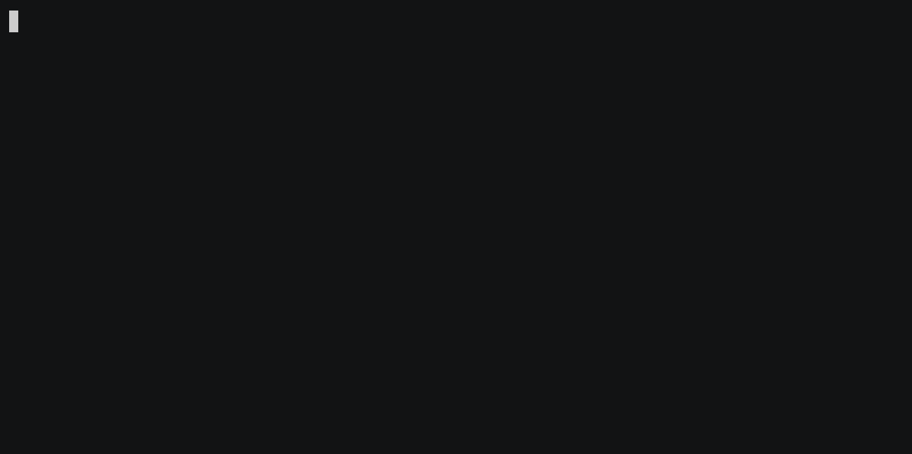
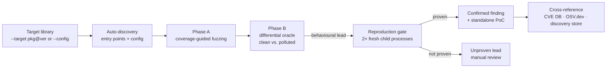

<h1 align="center">UoPFuzz</h1>

<p align="center">
  <b>Find prototype-pollution gadgets in JavaScript libraries — and only report the ones that actually reproduce.</b>
</p>

<p align="center">
  <a href="https://github.com/acuciureanu/uopfuzz/actions/workflows/ci.yml"></a>
  <a href="LICENSE"></a>
  = 18" src="https://img.shields.io/badge/node-%3E%3D18-brightgreen">
  
</p>

<p align="center">
  
</p>

UoPFuzz points coverage-guided fuzzing at a JavaScript library, pollutes
`Object.prototype`, and watches whether the library reads an attacker-controlled
property that reaches a dangerous sink (`eval`, `child_process.exec`,
`innerHTML`, `http.request`, `fs.readFile`, …). The name comes from the
**undefined-oriented programming (UOP)** view: a library reads a property that
*doesn't exist on the object*, so it resolves up the prototype chain to whatever
an attacker planted there.

What makes it different from a heuristic scanner: **a finding is only reported
after it is independently reproduced in fresh, isolated child processes.** No
reproduction, no vulnerability — just a clearly-labelled lead for manual review.

> ⚠️ **This is a research tool that executes untrusted code and generates real,
> working exploits.** Read [Safety model](#safety-model) before pointing it at a
> package you don't control.

---

## Contents

- [Why UoPFuzz](#why-uopfuzz)
- [How it works](#how-it-works)
- [Install](#install)
- [Quick start](#quick-start)
- [Use cases](#use-cases)
- [Understanding the output](#understanding-the-output)
- [Reproduction-gated reporting](#reproduction-gated-reporting)
- [Safety model](#safety-model)
- [Documentation](#documentation)
- [Contributing & security](#contributing--security)
- [License](#license)

## Why UoPFuzz

Prototype pollution is easy to *find* and hard to *prove*. A property read on a
polluted prototype might be exploitable, or it might be a dead end. Most tooling
stops at "this property was read" — which drowns you in false positives.

UoPFuzz is built around a single discipline: **causation over correlation, and
reproduction over heuristics.**

- **Differential oracle** — runs the target twice (clean vs. polluted) and only
  cares about behaviour the pollution *caused*.
- **Reproduction gate** — every candidate is re-proven in two fresh Node
  processes by a second, independent oracle that checks ground-truth facts (a
  real own-property added to a builtin prototype, or a canary that actually
  executes). On the project's [ground-truth benchmark](benchmark/RESULTS.md)
  this yields a **0% false-positive rate** against patched versions.
- **Runnable proof** — every confirmed finding ships a standalone PoC you can run
  with `node`.

It targets Node.js libraries (and browser-only libraries via jsdom), with a bias
toward real, published, high-impact bugs.

## How it works



| Stage | What it does |
|-------|--------------|
| **Target Integration** | Installs / loads the library and auto-generates entry points |
| **Input Generation** | Coverage-guided fuzzing with UOP-specific mutations (Thompson-sampled strategies) |
| **Instrumentation** | AFL-style edge coverage + V8 precise coverage + Proxy taint tracking |
| **Gadget Analysis** | Turns pollution → sink traces into ranked candidates |
| **Verification** | Reproduces each candidate in fresh child processes — the only thing that confirms a finding |

See [`docs/architecture.md`](docs/architecture.md) for the full pipeline.

## Install

Requires **Node.js ≥ 18**.

```bash
git clone https://github.com/acuciureanu/uopfuzz.git
cd uopfuzz
npm install
```

## Quick start

```bash
# Point it at an npm package@version — installs it, finds and verifies gadgets
node src/cli.js --target lodash@4.17.4

# Or use a curated YAML target spec
node src/cli.js --config config/targets/ejs.yaml --output results/
```

Confirmed findings and their PoCs are written under `results/`. Full flag
reference is in [`docs/usage.md`](docs/usage.md).

> `--target` installs a package from npm and **executes its code**. On a
> non-sandboxed host the command refuses unless you pass
> `--i-understand-untrusted-code`; the intended way to run untrusted targets is
> the container (see [Safety model](#safety-model)).

## Use cases

<details open>
<summary><b>1. Audit a dependency before you ship it</b></summary>

Point UoPFuzz at the exact version in your lockfile. If it confirms a gadget,
you get a runnable PoC and a CVE/OSV cross-reference telling you whether it's
already public. If nothing reproduces, the run exits clean — no noise.

```bash
node src/cli.js --target deep-extend@0.5.0
```
</details>

<details>
<summary><b>2. Verify a patch actually fixes the bug (version regression scan)</b></summary>

Scan a library across versions to see exactly where a vulnerability was
introduced or fixed — great for validating a security advisory or your own
patch.

```bash
node src/cli.js versions --library lodash.js --range 4.17.4..4.17.21
```
</details>

<details>
<summary><b>3. Reproduce a known CVE and get a PoC</b></summary>

The curated configs under `config/targets/` model published CVEs (e.g. EJS
CVE-2022-29078). UoPFuzz reproduces them end-to-end and drops a standalone PoC.

```bash
node src/cli.js --config config/targets/ejs.yaml
```
</details>

<details>
<summary><b>4. Hunt gadgets across many libraries at scale (mass mode)</b></summary>

Sweep the most-used libraries from cdnjs and surface anything that reproduces.
Run this **inside the container** — it installs and executes a lot of untrusted code.

```bash
./run-sandboxed.sh mass --top 50
```
</details>

<details>
<summary><b>5. Benchmark & research</b></summary>

A ground-truth benchmark pairs known-vulnerable and patched versions and
measures true-/false-positive rates end-to-end.

```bash
npm run benchmark          # full pipeline against real packages
npm run benchmark:self-test  # scoring logic only, installs nothing
```

See [`benchmark/RESULTS.md`](benchmark/RESULTS.md) for the latest run.
</details>

## Understanding the output

A run produces two kinds of result:

- **Confirmed findings** (`confirmedChains`) — reproduced in fresh processes.
  These are the real ones, and each ships a standalone PoC under `results/`.
- **Unproven leads** (`candidateChains`) — a behavioural signal that did *not*
  reproduce. Kept for manual review, never counted as a vulnerability.

Every confirmed finding is labelled against the built-in CVE database, live
OSV.dev advisories, and the tool's own discovery store:

| Label | Meaning |
|-------|---------|
| **KNOWN CVE** | Matches a published advisory (built-in DB or OSV.dev) |
| **PREVIOUSLY DISCOVERED** | This tool reproduced the same bug on an earlier run |
| **UNDOCUMENTED VULNERABILITY** | Not in the advisory DB or OSV.dev — **a candidate that still needs human verification and responsible disclosure**, not a confirmed 0-day |

The proof itself is one of: **prototype pollution** (a real own-property added to
a builtin prototype), **code execution** (a canary token actually ran), or
**sink reachability** (a polluted value reached a code/command sink argument —
flow proven, execution not).

## Reproduction-gated reporting

A finding becomes a reported **vulnerability** only when a second oracle —
sharing no verdict logic with discovery — reproduces its ground-truth condition
in **two independent fresh Node processes**. Behavioural heuristics (output
changed, a property merely read) never confirm on their own.

On the [ground-truth benchmark](benchmark/RESULTS.md) this is a **0%
false-positive rate** against patched versions. That's a strong empirical
result, not an absolute guarantee. The tool **files nothing externally** — every
disclosure decision is yours. See `src/verification/reproduce.js` and
`tests/integration/zero-fp-validation.test.js`.

## Safety model

**Target code is executed, not simulated.** Finding gadgets means *running* the
library with attacker-shaped inputs, and reproduction deliberately lets a canary
execute to prove code execution. Treat every target as untrusted code that will
run on your machine.

> **The real isolation boundary is the container** (`run-sandboxed.sh`, backed by
> `.devcontainer/`) — dropped capabilities, seccomp, `no-new-privileges`,
> non-root user, memory/PID caps, no host secrets. **Run untrusted targets there.**

<details>
<summary>What the in-process hardening does and does not cover</summary>

- Inside the container, every discovery mode that calls target code — plus
  reproduction — runs in **forked child processes** with best-effort in-process
  hardening (`src/utils/worker-hardening.js`): outbound network (opt-in via
  `--allow-network`), `child_process`, and `worker_threads` are patched off, and
  secret-bearing env vars are stripped. These are speed bumps, **not a sandbox**
  against a targeted exploit — the child shares the process uid, filesystem, and
  network namespace.
- Browser-only libraries load under jsdom *inside* that child.
- Honest caveats: the target module is `import()`ed in the fuzzer's own process
  to auto-generate its config (so module-load code runs unsandboxed), and
  auto-discovery invokes the target's functions in-process. `--no-sandbox` runs
  *everything* in-process. The container is the boundary that matters.
- The container gives capability/privilege containment, **not** network or
  filesystem confinement: egress is open (npm/OSV), `node_modules` is a
  persistent volume, and `results/` is a host bind-mount.

</details>

**Flags that lower the guardrails** (`--no-sandbox`, `--allow-scripts`,
`--allow-suspicious`, `--allow-network`) are opt-in and print a warning.

**Use it ethically.** Only analyze packages you are authorized to test. Live
OSV.dev lookups reveal the analyzed `package@version` to a third party
(`--no-osv` opts out). Generated PoCs under `results/` are **real, working
exploits** — handle them as sensitive, and disclose responsibly.

## Documentation

- [`docs/architecture.md`](docs/architecture.md) — pipeline and components
- [`docs/configuration.md`](docs/configuration.md) — YAML target format
- [`docs/usage.md`](docs/usage.md) — full CLI reference and the container workflow
- [`benchmark/RESULTS.md`](benchmark/RESULTS.md) — ground-truth benchmark

## Contributing & security

Contributions are welcome — see [`CONTRIBUTING.md`](CONTRIBUTING.md). To report a
security issue in the tool itself, or for the disclosure policy on findings, see
[`SECURITY.md`](SECURITY.md).

## License

[MIT](LICENSE) © Alexandru Cuciureanu
